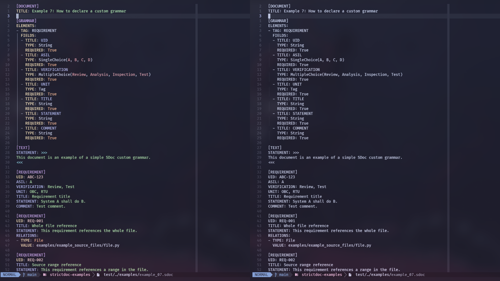

# StrictDoc Tree‑Sitter Parser for Neovim

This repository provides a Tree‑Sitter grammar for [StrictDoc](https://strictdoc.readthedocs.io/) and instructions to integrate it into Neovim using [nvim-treesitter](https://github.com/nvim-treesitter/nvim-treesitter).

## Prerequisites

- Neovim v0.8+ with [nvim-treesitter](https://github.com/nvim-treesitter/nvim-treesitter) installed
- A C compiler (`gcc` or `clang`) to build the parser
- Git

## Installation

### Using LazyVim

1. Place the following file in `~/.config/nvim/lua/plugins/nvim-treesitter.lua`:

```lua
return {
  "nvim-treesitter/nvim-treesitter",
  build = ":TSUpdate",
  opts = {
    ensure_installed = { "strictdoc" },
    highlight = { enable = true },
  },
  config = function(_, opts)
    -- Add custom filetype detection
    vim.filetype.add({
      extension = { sdoc = "sdoc" },
    })

    -- Register the custom parser configuration for strictdoc
    local parser_configs = require("nvim-treesitter.parsers").get_parser_configs()
    parser_configs.strictdoc = {
      install_info = {
        url = "https://github.com/manueldiagostino/tree-sitter-strictdoc",
        files = { "src/parser.c" },
        branch = "main",
      },
      filetype = "sdoc",
    }
    require("vim.treesitter.language").register("strictdoc", "sdoc")

    -- Apply the Treesitter settings
    require("nvim-treesitter.configs").setup(opts)

    -- After setup: ensure parser repo is available and copy missing query files
    local repo_url = "https://github.com/manueldiagostino/tree-sitter-strictdoc"
    local branch = "main"
    local install_path = vim.fn.stdpath("data") .. "/lazy/tree-sitter-strictdoc"
    if vim.fn.isdirectory(install_path) == 0 then
      vim.fn.system({
        "git",
        "clone",
        "--depth",
        "1",
        "--branch",
        branch,
        repo_url,
        install_path,
      })
      vim.notify("Cloned tree-sitter-strictdoc into " .. install_path, vim.log.levels.INFO)
    end

    local target_dir = vim.fn.stdpath("data") .. "/lazy/nvim-treesitter/queries/strictdoc"
    local query_files = { "highlights.scm", "tags.scm" }
    for _, fname in ipairs(query_files) do
      local source_file = install_path .. "/queries/" .. fname
      local target_file = target_dir .. "/" .. fname
      if vim.fn.filereadable(target_file) == 0 then
        vim.notify(fname .. " not found. Starting installation...", vim.log.levels.INFO)
        if vim.fn.filereadable(source_file) == 1 then
          if vim.fn.isdirectory(target_dir) == 0 then
            vim.fn.mkdir(target_dir, "p")
          end
          vim.fn.writefile(vim.fn.readfile(source_file), target_file)
          vim.notify(fname .. " copied to " .. target_file, vim.log.levels.INFO)
        else
          vim.notify(fname .. " not found at " .. source_file, vim.log.levels.ERROR)
        end
      end
    end
  end,
}
```

2. To verify the installation, restart Neovim and run:

```vim
:checkhealth nvim-treesitter
```

> To install an updated version of the highlighting files:
>
> ```
> rm -rf ~/.local/share/nvim/lazy/nvim-treesitter/queries/strictdoc/
> rm -rf ~/.local/share/nvim/lazy/tree-sitter-strictdoc
> ```
>
> and restart Neovim.

## Usage

Open any `.sdoc` file in Neovim. The filetype should be detected as `sdoc`, the parser will load automatically, and Tree‑Sitter will provide syntax highlighting, incremental selection, and more.

If highlighting isn't applied, verify:

```vim
:echo &filetype    " should return sdoc
:TSBufEnable highlight
```

## Example



## References

- StrictDoc [official website](https://strictdoc.readthedocs.io/en/stable/)
- StrictDoc [grammar](https://github.com/strictdoc-project/strictdoc/tree/main/strictdoc/backend/sdoc/grammar)
- [nvim-treesitter](https://github.com/nvim-treesitter/nvim-treesitter)
- [Adding custom parsers](https://github.com/nvim-treesitter/nvim-treesitter/wiki/Adding-parsers) to nvim-treesitter

## Contributing

Contributions are welcome! Please open issues or pull requests against this repository. Make sure to run `:TSUpdate strictdoc` and test your changes locally before submitting.

## License

This project is licensed under the MIT License. See [LICENSE](./LICENSE) for details.
